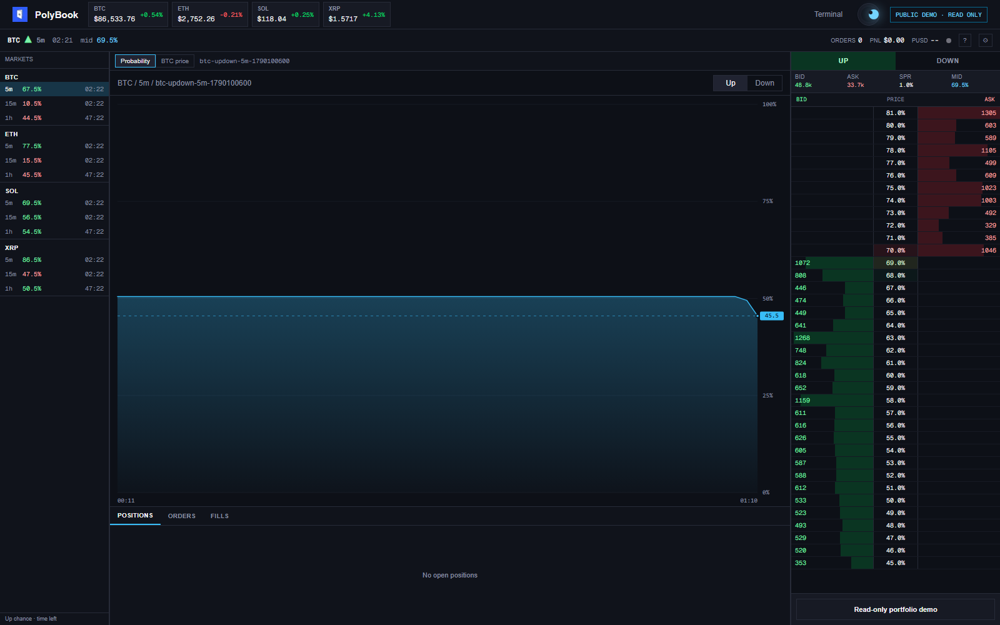
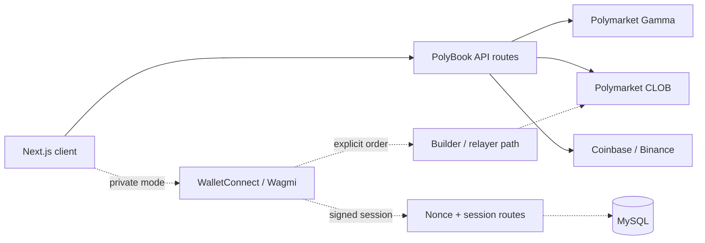

# PolyBook

PolyBook is a keyboard-first workspace for Polymarket fast crypto markets. It keeps the active market, probability history, reference crypto prices, orderbook depth, staged order controls, and account state on one screen.

The public build runs in read-only mode. It reads public market data but does not connect a wallet or submit orders. The private execution path must be enabled explicitly and requires separate database, session, wallet, and builder credentials.



## What the terminal does

- Resolves active BTC, ETH, SOL, and XRP fast-market windows.
- Reads Polymarket CLOB books and probability history.
- Pulls reference prices from Coinbase, with Binance as a fallback.
- Keeps 5 minute, 15 minute, and 1 hour markets in one rail.
- Shows a fixed DOM ladder, blotter, market countdown, open PnL, and balance state.
- Supports keyboard market switching and order shortcuts.
- Checks order size, spread, liquidity, network, wallet, balance, and allowance before submission.

## Public demo boundary

`NEXT_PUBLIC_ENABLE_LIVE_TRADING` defaults to `false`. In that mode:

- public prices, charts, and books remain available;
- wallet controls are hidden;
- ladder rows cannot stage orders;
- the order ticket states that the deployment is read-only;
- database and builder credentials are not needed for `npm run build`.

Live trading is not a switch to turn on casually. It also needs wallet authentication, MySQL persistence, Polymarket builder credentials, Polygon configuration, and deployment-specific geographic controls.

## Architecture



Public market-data routes do not import or initialize the private database connection. The MySQL pool is created only when an authenticated route actually needs it, so a read-only deployment can build without placeholder secrets.

## Run locally

Requirements: Node.js 20 or newer.

```bash
npm ci
copy .env.example .env.local
npm run dev
```

Open [http://localhost:3002](http://localhost:3002). The landing page explains the product; `/terminal` opens the live read-only workspace.

Useful checks:

```bash
npm run lint
npm run build
```

## Configuration

Start from [`.env.example`](.env.example).

| Variable | Public demo | Private execution | Purpose |
| --- | --- | --- | --- |
| `NEXT_PUBLIC_ENABLE_LIVE_TRADING` | `false` | `true` | Exposes wallet and execution controls |
| `NEXT_PUBLIC_APP_URL` | optional | required | Canonical deployment URL and wallet metadata |
| `NEXT_PUBLIC_REOWN_PROJECT_ID` | optional | required | Public Reown project identifier |
| `DB_*` | unused | required | MySQL session and wallet persistence |
| `JWT_SECRET` | unused | required | Signed session cookie |
| `POLY_BUILDER_*` | unused | required | Server-side builder credentials |

Builder secrets and passphrases belong on the server. Do not expose them through `NEXT_PUBLIC_*` variables or commit them to Git.

## Main code paths

```text
src/app/page.tsx                         Portfolio landing page
src/app/(routes)/terminal/page.tsx      Public terminal route
src/app/(routes)/scalpTerminal/         Trading workspace
src/app/Components/terminal/            Rail, ladder, blotter, tickets
src/app/api/pol/                         Orderbook and chart adapters
src/app/api/crypto/                      Reference price adapters
src/app/lib/polymarket/                  Market-window resolution
src/app/lib/auth/                        Nonces and signed sessions
db/migrations/                           MySQL schema history
```

## Current scope

The public portfolio deployment is a market-data and interface demo. The repository still contains the private execution path for local development, but no claim is made that a public deployment can place orders safely without its full infrastructure and operational controls.
